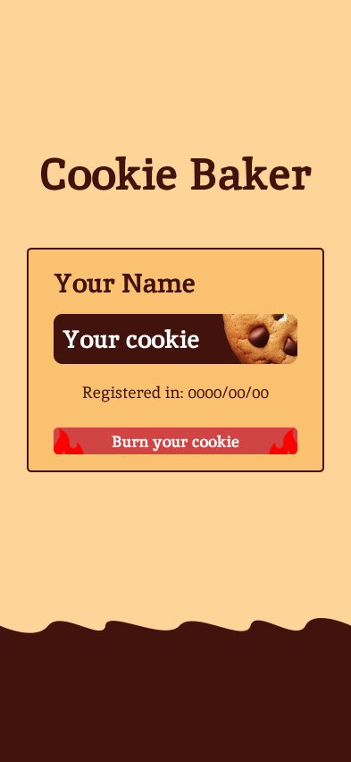
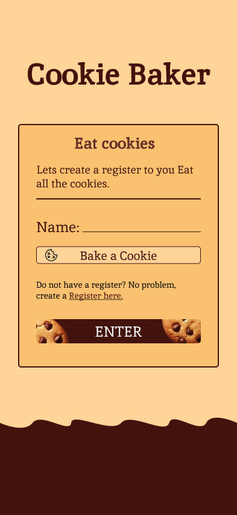

# 🍪 Cookies Baker

Projeto criado para demonstrar habilidades com **servidor**, **banco de dados** e **manipulação de cookies** no navegador.

> ⚠️ *Este projeto precisa ser clonado localmente, pois o GitHub Pages não suporta servidores back-end.*

---

## ✨ Imagens ilustrativas

  

---

## 🧰 Stack utilizada

- **Fastify** – Servidor Node.js rápido e leve  
- **React** – Interface do usuário (Front-end)  
- **MongoDB** – Banco de dados NoSQL para armazenamento  

---

## 🔍 Observações

Uma particularidade marcante do projeto são as **animações dos cookies girando** 🍪.  
Assim que você preenche o campo `name`, o cookie começa a girar, e então é possível **receber o cookie** e **cadastrar as informações**.
